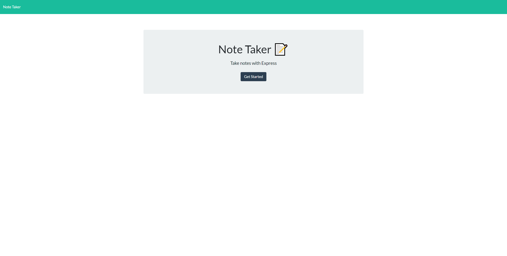

# Express Note Taker

# What is this?
- This is a note taking application built using express.js to connect a front end and backend application to create and store data
- I built this project as part of requirment for my fullstack developer certifcation as well as a display of my work for future employers

# Usage 
- You can use this app at (https://salty-savannah-94786.herokuapp.com/)

# Credits
- The UofM Coding bootcamp for the starter code
- All the assistants at askBCS for helping me when I found myself lost or confused
